# Cross-Lingual Word Embedding Alignment: English to Hindi

## 1. Introduction

This report presents the implementation and evaluation of a supervised cross-lingual word embedding alignment system for English and Hindi languages using the Procrustes method. Cross-lingual word embeddings enable mapping words from different languages into a shared semantic space, which is fundamental for multilingual NLP tasks such as machine translation, cross-lingual information retrieval, and knowledge transfer.

## 2. Environment Setup

Reproducible computational environments are crucial for research. This project utilizes the Conda package and environment management system, specifically leveraging Mamba for enhanced performance.

### 2.1 Mamba vs. Conda

*   **Conda:** A widely used open-source package management and environment management system that runs on Windows, macOS, and Linux. It allows users to create isolated environments containing specific versions of Python and other packages. Miniconda is a minimal installer for Conda.
*   **Mamba:** A reimplementation of the Conda package manager in C++. It offers significantly faster dependency solving and package downloading/installation compared to the standard `conda` command, primarily due to parallel processing and more efficient algorithms. Mamba is largely command-line compatible with Conda and uses the same environment structure and package sources (channels like `conda-forge`). It's typically installed within an existing Miniconda or Anaconda setup.

For this project, using Mamba within a Miniconda distribution is recommended for faster environment setup and package management.

### 2.2 Installation and Usage

The recommended way to manage the environment for this project is using **Mamba** with the provided `environment.yaml` file. Mamba is included in the **Miniforge** distribution, which is the recommended Conda installer for this setup.

1.  **Install Miniforge:** If you don't have a Conda distribution with Mamba installed, download and install the Miniforge installer appropriate for your operating system from the official repository: [https://github.com/conda-forge/miniforge](https://github.com/conda-forge/miniforge). Follow the instructions provided by the installer. This sets up a base Conda environment that includes Mamba and defaults to the `conda-forge` channel.

2.  **Verify Mamba Installation (Optional):** After installation, open a new terminal window (or Anaconda Prompt on Windows) and run `mamba --version` to confirm it's installed correctly.

3.  **Create Environment from File (Primary Method):** Navigate to the root directory of this project in your terminal (the directory containing the `environment.yaml` file) and create the project environment using the following Mamba command:
    ```bash
    mamba env create -f environment.yaml
    ```
    This command reads the `environment.yaml` file (which specifies the environment name `muse_env`, channels, and all necessary dependencies including Python 3.8 and packages like PyTorch, Faiss, etc.) and installs everything required, ensuring a consistent and reproducible setup.

4.  **Activate the Environment:** Before running any project code, activate the newly created environment:
    ```bash
    conda activate muse_env
    ```
    *(Note: The environment name `muse_env` is defined within the `environment.yaml` file).*

## 3. Methodology

### 3.1 Procrustes Alignment

The Procrustes method is a linear transformation approach that finds the optimal orthogonal mapping between two sets of embeddings. Given source embeddings X and target embeddings Y, along with a bilingual dictionary that maps words from the source language to the target language, the objective is to find an orthogonal matrix W that minimizes:

$\min_{W \in \mathcal{O}_d} \|WX - Y\|_F$

Where $\mathcal{O}_d$ is the space of orthogonal matrices of dimension d×d. This constraint ensures that the mapping preserves distances and angles between word vectors, maintaining the structural properties of the original embedding space.

The solution to this optimization problem is given by:
$W = UV^T$, where $UΣV^T$ is the singular value decomposition of $YX^T$.

### 3.2 Iterative Refinement

The alignment process is iterative, following these steps:
1. Initial dictionary-based alignment using Procrustes
2. Building a new dictionary based on the current alignment
3. Realigning using the new dictionary
4. Repeating steps 2-3 for a fixed number of iterations

This process helps improve the quality of the alignment by iteratively refining the set of word pairs used for training.

## 4. Implementation

### 4.1 Data Preparation

The foundation of cross-lingual alignment lies in high-quality monolingual word embeddings. The process for generating these embeddings for English (en) and Hindi (hi) was managed by the `fastText_model.py` script, which largely follows the methodology described in the MUSE paper (Conneau et al., 2017, Section 3.1) while also addressing the requirements of the assignment (`assgn.txt`, Data Preparation section). Embeddings for Spanish (es) and IAST-transliterated Hindi (hi_latin) were also prepared using the same script for later experiments (detailed in Section 6), but the primary focus *in this section* is on the preparation for supervised alignment using English and standard Devanagari Hindi. The preparation of transliterated Hindi embeddings for unsupervised experiments differed and is detailed later (Section 6.1).

The pipeline implemented in `fastText_model.py` involved the following steps for each language:

1.  **Wikipedia Data Acquisition:** The latest Wikipedia dump (`*-latest-pages-articles-multistream.xml.bz2`) was downloaded for the respective language using the `download_wiki_dump` function.
2.  **Text Extraction and Tokenization:** Text content was extracted from the downloaded dump using `gensim`'s `WikiCorpus`. The `extract_wiki_text` function processed the articles, applying a simple whitespace tokenizer (`simple_tokenize`) that converted text to lowercase and filtered tokens to be between 2 and 100 characters long. Applying the assignment's guideline (`assgn.txt`, Data Prep a) *for the standard Hindi embeddings used in supervised experiments (Section 5)*, text was extracted from the first 10,000 articles (`--article_limit=10000` argument in `fastText_model.py`).
3.  **Transliteration (for Hindi - Optional):** For generating the `hi_latin` embeddings used in the unsupervised experiments (Section 6), the Hindi text was processed differently, involving transliteration *from a much larger corpus (116,035 articles, see Section 6.1)* using the `indic-transliteration` library (`transliterate_text` function). *In contrast,* the standard Hindi embeddings (`wiki.hi.vec`) used for the supervised experiments *described here* were trained directly on the Devanagari text extracted from the 10k articles mentioned above.
4.  **fastText Model Training:** A fastText model was trained on the processed text (either original or transliterated) using the `train_fasttext_model` function. Key parameters were set to align with the MUSE paper's specifications (Section 3.1):
    *   `model='skipgram'`
    *   `dim=300` (embedding dimension)
    *   `minCount=5` (minimum word frequency)
    *   `epoch=5`, `lr=0.05` (default training parameters in the script)
    The trained model was saved in the standard `.bin` format (e.g., `wiki.en.bin`, `wiki.hi.bin`).
5.  **Vocabulary Filtering and Vector Export:** The embeddings for the top `N` most frequent words were exported to the standard `.vec` text format using the `filter_top_words` function. For the supervised experiments described in Section 5, the vocabulary was limited to the top 100,000 words, aligning with the assignment requirement (`assgn.txt`, Data Prep b). For the unsupervised experiments discussed later (Section 6), a vocabulary limit of 200,000 words was used. The resulting files containing the 100k vocabulary (e.g., `data/wiki.en.vec`, `data/wiki.hi.vec`) were used in the supervised alignment experiments.

To fulfill the assignment requirement (`assgn.txt`, Data Prep c) of obtaining bilingual lexicons and evaluation data from the MUSE dataset, the necessary files were downloaded using `wget`:

```bash
cd data/ # Assuming execution from the project root
wget https://dl.fbaipublicfiles.com/arrival/dictionaries.tar.gz
wget https://dl.fbaipublicfiles.com/arrival/wordsim.tar.gz
tar -xzf dictionaries.tar.gz
tar -xzf wordsim.tar.gz
cd ..
```
This provided the training and evaluation dictionaries (e.g., `en-hi.txt`, `en-hi.5000-6500.txt`) and word similarity datasets used throughout the project.

Finally, to establish a visual baseline before alignment, the `compare_embeddings` function within `fastText_model.py` was used to generate a t-SNE plot comparing the raw English and Hindi embeddings (using the top 1000 words from each for clarity).

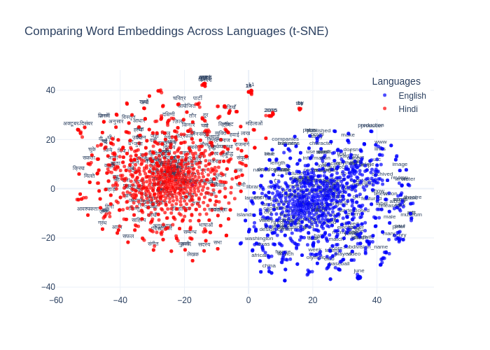

As shown in the figure above (`comparison_en_vs_hi.png`), the initial embedding spaces for English (blue) and Hindi (red) are largely separated, illustrating the need for an alignment process to map them into a shared semantic space. This visualization serves as the starting point against which the effectiveness of the alignment (shown later in Section 5.1) can be qualitatively assessed.

### 4.2 Orthogonality Verification

To ensure the mapping preserved distances and angles, a verification function was implemented that checks whether $W^TW$ is close to the identity matrix:

```python
def verify_orthogonality(W):
    WtW = torch.mm(W.t(), W)
    I = torch.eye(W.shape[1], device=W.device)
    error = torch.norm(WtW - I).item()
    is_orthogonal = error < 1e-4
    return is_orthogonal, error
```

## 5. Experimental Setup
The experiments described in this section focused exclusively on aligning English and non-transliterated Hindi embeddings.

The core supervised alignment process and the ablation study on dictionary size were managed by the `muse_wrapper.py` script. This script automates the following workflow:
1.  **Configuration:** Parses command-line arguments to set up experiment parameters, including language identifiers, embedding paths, vocabulary sizes, normalization methods, and refinement settings.
2.  **Dictionary Size Iteration:** Loops through a predefined list of bilingual dictionary sizes: 1,000, 2,000, 5,000, 10,000, and 20,000 word pairs.
3.  **Experiment Execution per Size:** For each dictionary size:
    *   **Dictionary Preparation:** Creates a training dictionary of the specified size by randomly sampling from a larger combined dictionary file (`en-hi.txt`), ensuring that pairs present in the validation set (`en-hi.5000-6500.txt`) are excluded.
    *   **Model Training:** Initializes the MUSE model components (source and target embeddings, mapping layer).
    *   **Alignment and Refinement:** Performs the alignment using the Procrustes method followed by a specified number of iterative refinement steps (`n_refinement`). In each refinement step beyond the first, a new dictionary is built based on the current alignment using a specified method (e.g., CSLS KNN).
    *   **Orthogonality:** Verifies if the learned mapping matrix `W` is orthogonal ($W^T W \approx I$). If the deviation exceeds a threshold and orthogonalization is enabled (`map_beta > 0`), it applies an iterative orthogonalization procedure.
    *   **Evaluation:** Calculates standard word translation evaluation metrics (Precision@1 and Precision@5 using both Nearest Neighbor and CSLS retrieval) on the designated evaluation dictionary. Additionally, it computes the average cosine similarity between the mapped source vectors and the target vectors for the word pairs in the evaluation dictionary.
    *   **Best Model Saving:** Tracks performance across refinement iterations and saves the mapping matrix (`best_mapping_dico<size>.pth`) corresponding to the iteration that yielded the highest average cosine similarity.
4.  **Result Aggregation & Visualization:** After running experiments for all dictionary sizes, the script aggregates the final metrics from the best model for each size into a JSON file (`all_results.json`) and generates interactive HTML plots (`precision_results.html`, `mapping_quality.html`) visualizing the relationship between dictionary size and performance metrics.

To facilitate running these experiments, particularly with different hyperparameter configurations, the `run_supervised.sh` script was created. This Bash script provides several conveniences:
*   **Base Command:** Defines the fundamental command to execute `muse_wrapper.py` with the source (`en`), target (`hi`), and their respective embedding file paths (`data/wiki.en.vec`, `data/wiki.hi.vec`).
*   **CPU/GPU Control:** Allows specifying `--cpu` as an argument to force execution on the CPU by appending `--cuda False` to the base command; otherwise, it defaults to using the GPU.
*   **Experiment Runner:** Includes a function `run_experiment` that takes an experiment name and the full command. It executes the command, simultaneously displaying the output to the console and saving it (both standard output and standard error) to a log file named `experiment_logs/<experiment_name>.log`.
*   **Hyperparameter Testing Menu:** Presents an interactive menu prompting the user to select which set of experiments to run. This allows easily testing variations of hyperparameters used by `muse_wrapper.py`, such as:
    *   `--normalize_embeddings`: Type of embedding normalization (e.g., `center`, `renorm`, `center,renorm`).
    *   `--n_refinement`: Number of refinement iterations (e.g., 3, 10; default is 5).
    *   `--dico_build`: Strategy for building the dictionary in refinement steps (e.g., `S2T|T2S` which uses pairs found from source-to-target and target-to-source searches).
    *   `--dico_threshold`: Similarity threshold for including pairs in the refinement dictionary.
    *   `--map_beta`: Strength of the orthogonality constraint regularization.
    *   `--dico_method`: Method for finding nearest neighbors when building the refinement dictionary (e.g., `csls_knn_5`, `csls_knn_15`).
The script offers options to run a baseline configuration, specific tests focusing on one hyperparameter, a `combined_best` configuration using potentially optimal settings derived from individual tests, or all predefined experiments sequentially.

### 5.1 Ablation Study on Dictionary Size

As per the assignment requirements, an ablation study was first conducted to assess the impact of bilingual lexicon size on alignment quality. The experiments were run with dictionary sizes of:
- 1,000 word pairs
- 2,000 word pairs
- 5,000 word pairs
- 10,000 word pairs
- 20,000 word pairs

The models for each dictionary size were selected based on the refinement iteration that yielded the highest average cosine similarity on the evaluation set (`en-hi.5000-6500.txt`). The key performance metrics for these best models are summarized below:

| Dictionary Size | Best Iter | Avg Cosine Sim | P@1 (NN) | P@1 (CSLS) | P@5 (NN) | P@5 (CSLS) |
|-----------------|-----------|----------------|----------|------------|----------|------------|
| 1,000           | 3         | 0.3841         | 31.30%   | 37.19%     | 49.25%   | 54.45%     |
| 2,000           | 2         | 0.3853         | 31.44%   | 37.81%     | 49.59%   | 56.10%     |
| 5,000           | 2         | 0.3862         | 32.19%   | 38.84%     | 49.45%   | 56.58%     |
| 10,000          | 1         | 0.3878         | 32.12%   | 38.63%     | 50.07%   | 56.51%     |
| 20,000          | 1         | 0.3893         | 32.60%   | 38.77%     | 50.21%   | 57.26%     |

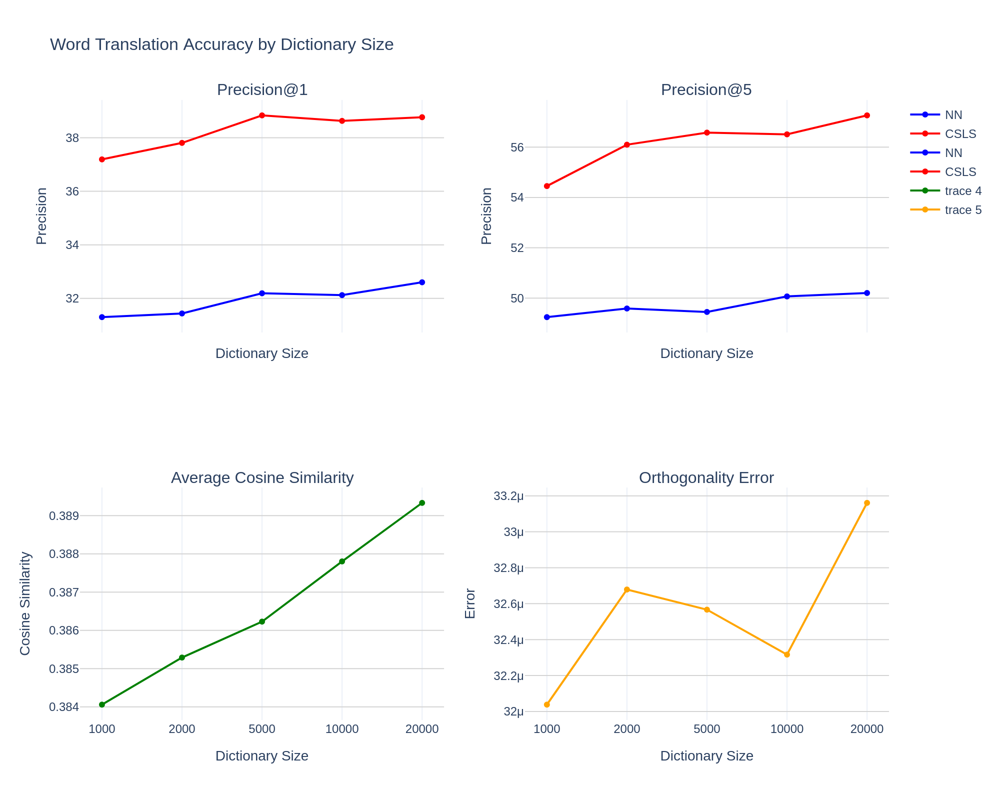

As depicted in the table and the figure above (`all_metrics_by_dict_size_20250407_122416.png`), increasing the initial dictionary size generally leads to improvements in both precision (especially P@1 CSLS) and average cosine similarity. The gains appear to diminish somewhat with larger dictionary sizes, suggesting potential saturation, particularly between 10k and 20k pairs for this dataset and configuration.

The iterative refinement process plays a crucial role. Analyzing the metrics across the 10 refinement iterations for each dictionary size (as shown in the plots below) reveals important dynamics:
*   Performance generally peaks within the first few refinement iterations. Smaller dictionaries (1k, 2k, 5k) tend to peak slightly later (iterations 2-3) compared to larger dictionaries (10k, 20k), which often peak immediately at iteration 1.
*   After the peak, performance tends to plateau or slightly decline, particularly for the largest (20k) dictionary size.

    *Plots showing refinement trends for each dictionary size:* 
    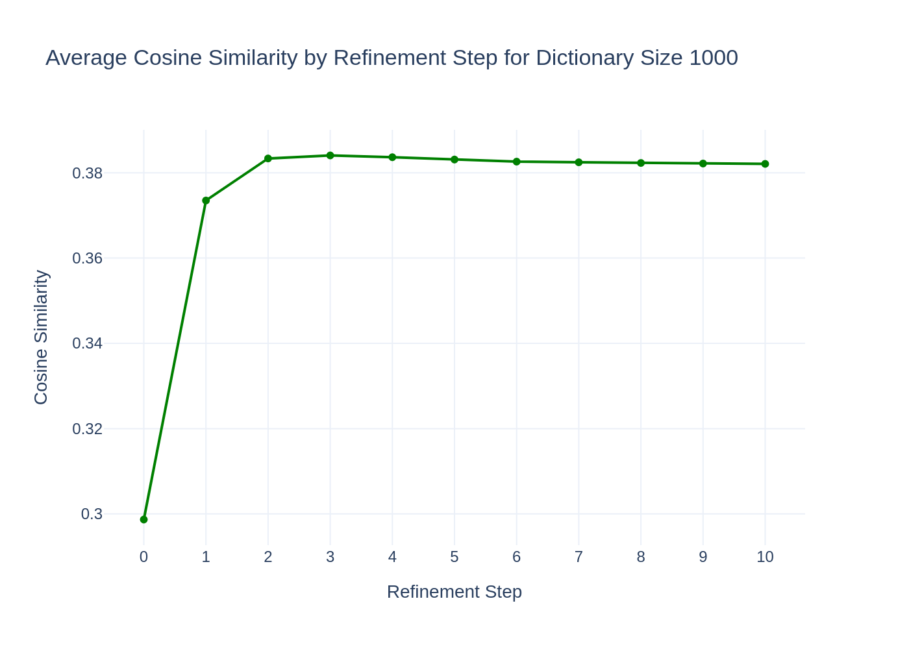
    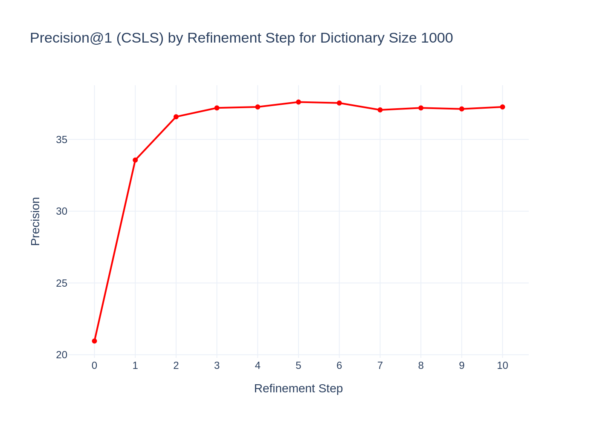
    
    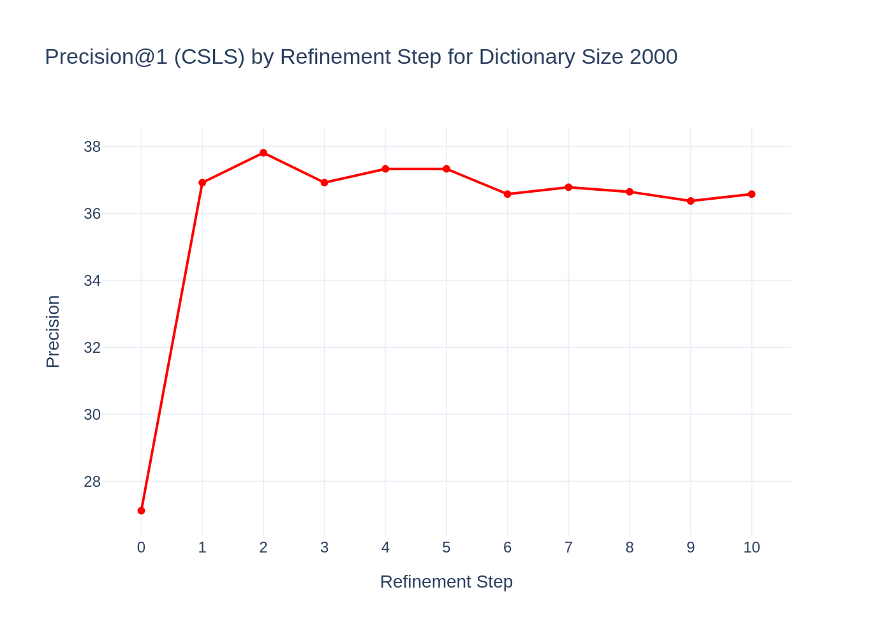
    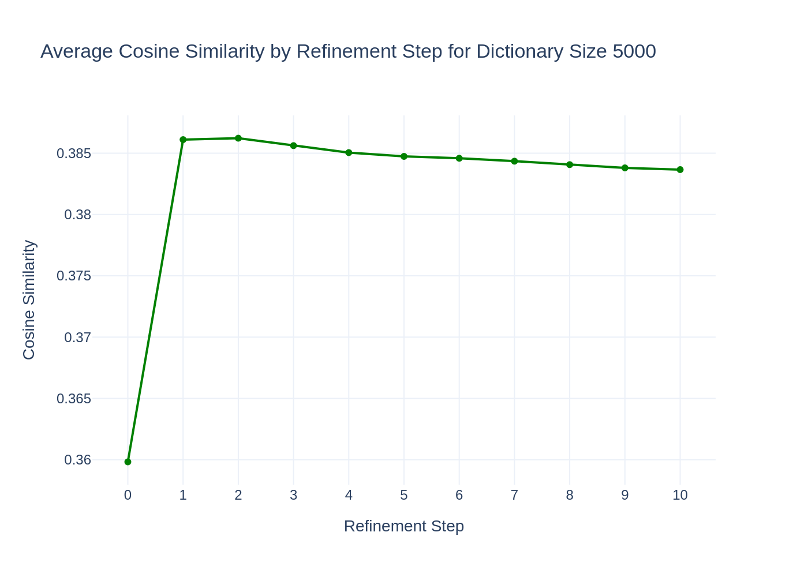
    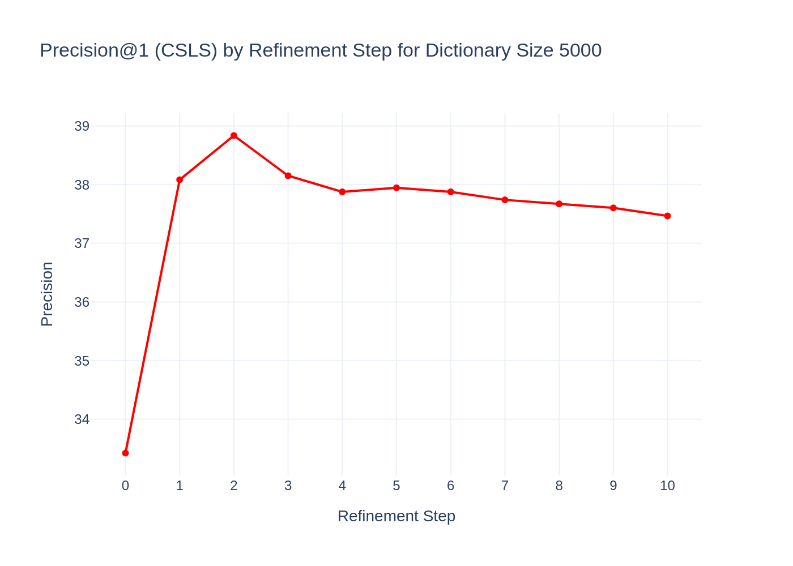
    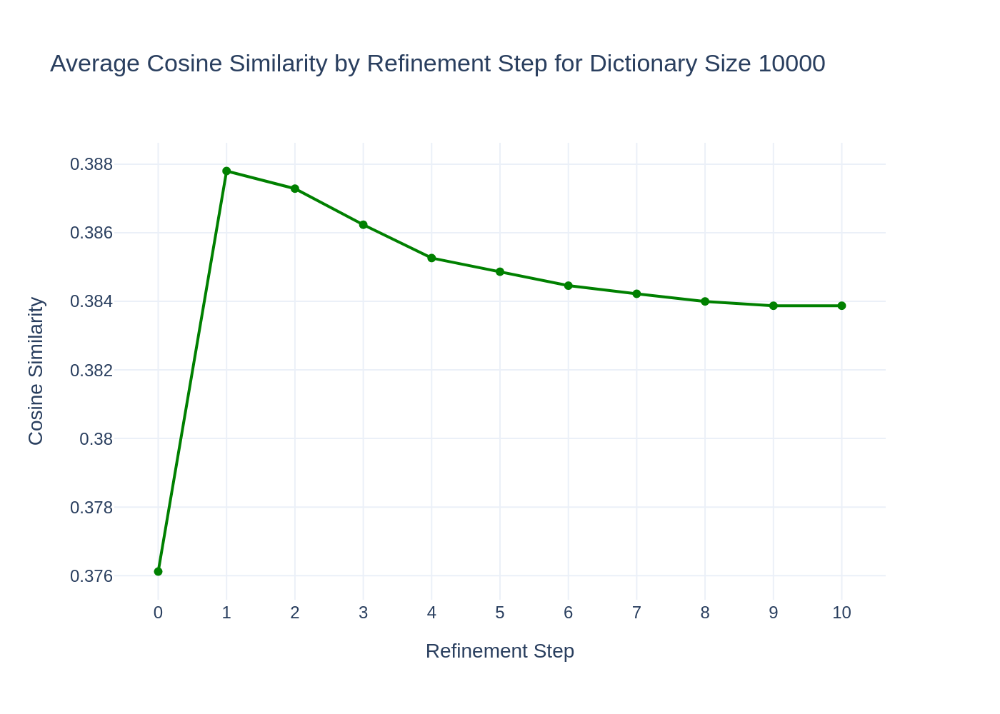
    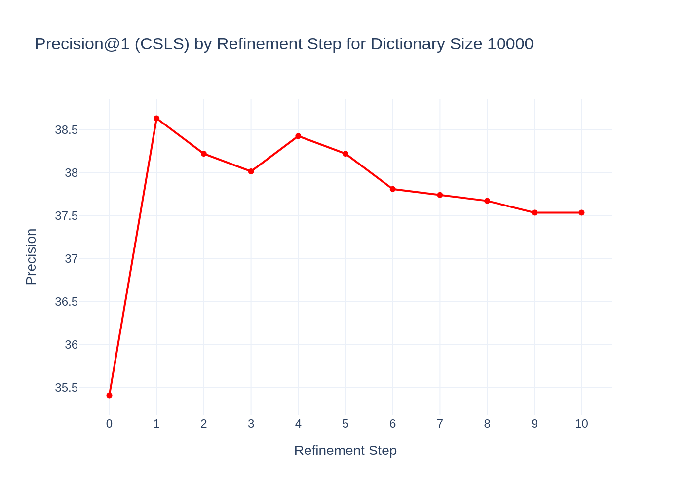
    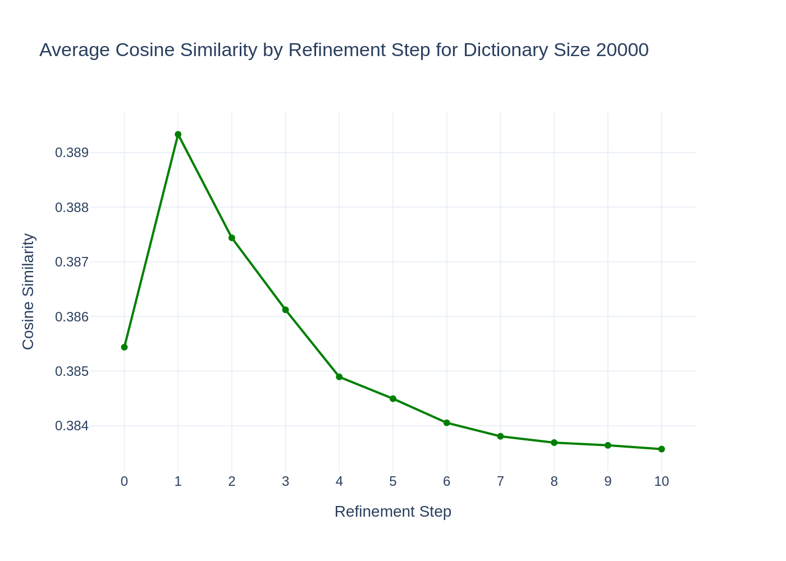
    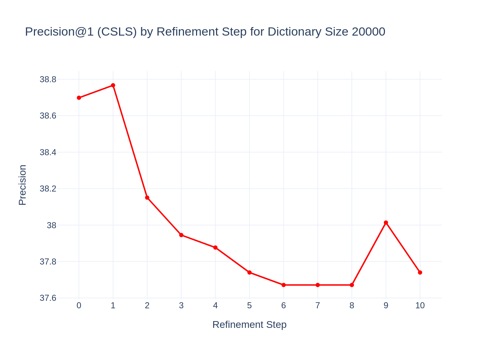

A notable contrast is evident when comparing the average cosine similarity refinement trends for the 1k and 20k dictionary sizes (compare plots for 1k and 20k Avg Cosine Sim). The 1k experiment shows gradual improvement over the first few iterations, suggesting that refinement successfully bootstraps a better alignment from a weaker starting point. Conversely, the 20k experiment peaks at iteration 1 and then declines. This could be because the initial Procrustes alignment with 20k pairs is already quite strong. Subsequent refinement iterations, while potentially finding more pairs based on the current (already good) alignment, might introduce noisier or less globally optimal pairs, causing the performance on the fixed evaluation set to degrade slightly. The system might be overfitting subtly to the characteristics of the pairs generated during refinement, especially when starting from a large, high-quality initial dictionary.

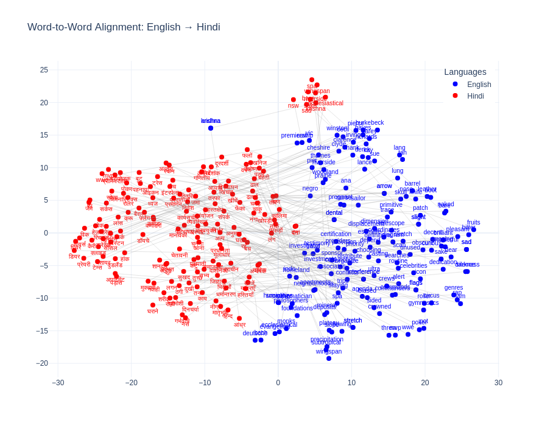

The figure above (`word_pair_alignment.png`) visualizes the alignment of English (blue) and Hindi (red) word embeddings after the supervised training process (using the best model from the 20k dictionary size experiment). Qualitatively, the alignment appears to have brought the embeddings from the two languages closer compared to their initial state (in Section 4.1 with `comparison_en_vs_hi.png`). While the clouds are not perfectly overlapping, the increased intermingling suggests that the alignment process has been partially successful in mapping words with similar meanings closer together in the shared embedding space.

These findings have practical implications for developing multilingual NLP systems, particularly for low-resource language pairs. Even with limited bilingual resources, effective cross-lingual embeddings can be constructed through careful optimization of the alignment process.


## 6. Unsupervised Alignment Experiments

Unsupervised alignment using adversarial training combined CSLS refinement, similar to the MUSE paper, was explored. Aligning English and Hindi, a distant language pair with different scripts, presented significant challenges compared to closer pairs or supervised methods.

### 6.1 Initial Attempts and Strategy:

The core issue with different scripts (Devanagari vs. Latin) is that the initial embedding spaces are structurally very different. An adversarial discriminator can easily distinguish between embeddings drawn from these spaces with high accuracy from the start. If the discriminator is too effective, it provides no useful gradient signal back to the mapping function (W), preventing the mapping from learning to align the spaces. Initial attempts using standard parameters for En-Hi resulted in zero precision for this reason.

The strategy therefore involved several steps:

1.  **Initial Attempts and Sanity Check:** The very first attempt focused on the target pair: English-Hindi (using original Devanagari embeddings). As anticipated due to the script difference and linguistic distance, this yielded zero precision even with standard MUSE parameters. 

    The core challenge with unsupervised alignment between languages with vastly different structures, especially different scripts (Latin vs. Devanagari), is twofold: (1) the underlying assumption of similar geometric structure for the adversarial approach often doesn't hold, and (2) the discriminator can too easily distinguish the source and target embeddings from the start. This leads to discriminator overfitting and provides no useful gradient for learning the alignment map, a known issue for such language pairs (Vulić et al., 2019).

    To confirm the basic viability of the unsupervised approach under more favorable conditions, a sanity check was performed using English-Spanish (`en-es`), a closer language pair sharing the Latin script. However, even this initial En-Es run using standard parameters failed to produce meaningful alignment, suggesting parameter tuning was necessary even for easier pairs.

2.  **Successful Spanish Baseline:** Only after weakening the discriminator parameters (`dis_dropout=0.3`, `dis_input_dropout=0.3`, `map_beta=0.01`) compared to the original paper specifications did the English-Spanish alignment succeed. This successful run achieved a reasonable Precision@1 (CSLS) of 43.98% after 5 adversarial epochs and 5 refinement steps. This established a crucial baseline, confirming the general approach could work under less challenging conditions once parameters were appropriately tuned to prevent discriminator overfitting.

    The English-Spanish (en-es) baseline experiment with weakened discriminator parameters (dis_dropout=0.3, dis_input_dropout=0.3, map_beta=0.01) demonstrated that the unsupervised approach could work effectively for language pairs sharing the same script. The following table summarizes the results after 5 adversarial epochs followed by 5 refinement iterations:

| Phase | Iteration | P@1 (NN) | P@1 (CSLS) | P@5 (NN) | P@5 (CSLS) | Mean Cosine (CSLS) |
|-------|-----------|----------|------------|----------|------------|-------------------|
| Adversarial | 0 | 6.77% | 6.77% | 6.77% | 6.77% | 0.3738 |
| Refinement | 1 | 33.90% | 37.35% | 49.87% | 54.47% | 0.5653 |
| Refinement | 2 | 38.97% | 42.69% | 53.79% | 58.59% | 0.5774 |
| Refinement | 3 | 39.65% | 43.57% | 54.80% | 58.86% | 0.5771 |
| Refinement | 4 | 40.05% | 43.98% | 55.21% | 59.07% | 0.5768 |

    
This table clearly demonstrates the progressive improvement of alignment quality through the refinement process. Starting from a very low precision (6.77%) after the adversarial phase, the model achieved a respectable Precision@1 (CSLS) of 42.69% by the second refinement iteration. The results stabilized in later iterations, with only marginal improvements in precision and a slight decrease in mean cosine similarity, indicating an optimal point had been reached.

The success of this experiment with Spanish provided a critical baseline confirming that the approach could work with appropriately tuned parameters, even though the initial attempt with default parameters had failed. This guided the subsequent strategy for handling the more challenging English-Hindi transliterated alignment.

3.  **Hindi Transliteration and Vocabulary Expansion:** To mitigate the script difference issue, the Hindi text corpus was transliterated from Devanagari to Latin script (specifically IAST) using the `transliterate_dict_new.py` script (which leverages the `indic_transliteration` library). However, processing only the initial 10,000 Wikipedia articles yielded a vocabulary size significantly smaller than the 200k used for English after transliteration. To ensure comparable vocabulary sizes, the constraint was relaxed, and 116,035 Hindi articles were processed, yielding ~260k unique transliterated words. The top 200k words were then used to train the `data/wiki.hi_latin.vec` embeddings via `fastText_model.py`. The evaluation dictionary (`data/dictionaries/en-hi.5000-6500.txt`) was also transliterated using the same script to create `data/dictionaries/en-hi_latin.5000-6500_iast.txt`.


### 6.2 Experimentation Framework (`run_unsupervised.sh`):

The `run_unsupervised.sh` script provides a simplified framework for running and testing different configurations of the unsupervised alignment process. It offers 3 preset experiment configurations via an interactive menu:

1.  **`weaker_discriminator` (baseline)**: Executes the English-Spanish alignment using weakened discriminator parameters, serving as a baseline for closer language pairs.
2.  **`hindi_latin_weak_disc`**: Runs the English to transliterated Hindi alignment using parameters specifically tuned for this more challenging task (details below). This configuration corresponds to the results presented in Section 6.3.
3.  **`hindi_latin_extended_training`**: Runs the English to transliterated Hindi alignment with different training duration and learning rate parameters compared to option 2.

The key configuration **(option 2: `hindi_latin_weak_disc`)** uses parameters adapted for the distant English-Hindi (Latin script) pair. This configuration runs with the following command:

```bash
python -u unsupervised.py --batch_size 32 --normalize_embeddings center,renorm --dis_dropout 0.4 --dis_input_dropout 0.3 --dis_steps 3 --dis_most_frequent 20000 --map_beta 0.01 --visualize_final_alignment true --src_lang en --tgt_lang hi_latin --src_emb data/wiki.en.vec --tgt_emb data/wiki.hi_latin.vec --n_refinement 8 --n_epochs 25 --epoch_size 500000 --map_optimizer sgd,lr=0.1 --dis_optimizer sgd,lr=0.01 --dico_eval data/dictionaries/en-hi_latin.5000-6500_iast.txt --early_stopping_patience 5 --dis_lambda 1.2
```

Key parameters and insights from this configuration include:
- Higher discriminator dropout (`dis_dropout=0.4`, `dis_input_dropout=0.3`) to mitigate discriminator overfitting.
- A very low discriminator learning rate (`dis_optimizer sgd,lr=0.01`) compared to the mapping learning rate (`map_optimizer sgd,lr=0.1`).
- Extended training duration (`n_epochs=25`, `n_refinement=8`) to allow for gradual alignment.
- Early stopping (`early_stopping_patience=5`) based on evaluation set performance to prevent overfitting during refinement.
- Increased discriminator weight (`dis_lambda=1.2`) to ensure a sufficient adversarial signal despite the weaker discriminator settings.
- Visualization of the final alignment enabled (`visualize_final_alignment true`).

### 6.3 Results (Unsupervised En-Hi_transliterated):

The unsupervised alignment experiment between English and transliterated Hindi demonstrated both the potential and limitations of the approach. After careful parameter tuning, the model achieved meaningful results. Below is a comprehensive analysis of the results:

#### 6.3.1 Adversarial Training Phase

The initial adversarial training phase showed a gradual improvement in alignment quality:

| Metric | Epoch 0 | Epoch 1 | Epoch 12 | Epoch 24 (Final) |
|--------|---------|---------|----------|------------------|
| P@1 (CSLS) | 0.00% | 0.00% | 8.64% | 14.20% |
| P@5 (CSLS) | 0.00% | 6.86% | 19.27% | 27.91% |
| P@10 (CSLS) | 0.00% | 6.86% | 23.18% | 31.96% |
| Mean Cosine (CSLS) | 0.3344 | 0.3689 | 0.4479 | 0.4702 |
| Disc. Accuracy | 68.77% | 60.33% | 80.87% | 96.01% |

Key observations from the adversarial phase:
1. **Initial Struggle**: The model started with zero precision, illustrating the difficulty of unsupervised alignment for distant languages.
2. **Gradual Improvement**: Over 25 epochs, the precision steadily increased, reaching 14.20% for P@1 (CSLS).
3. **High Discriminator Accuracy**: The discriminator accuracy remained high throughout training (reaching 96.01%), which is expected for distant languages and was managed by using a lower learning rate and higher dropout.
4. **Increasing Mean Cosine Similarity**: The mean cosine similarity gradually improved from 0.3344 to 0.4702, indicating a better mapping quality.

#### 6.3.2 Refinement Phase

The refinement phase, consisting of 8 iterations of Procrustes alignment and dictionary building, significantly improved the results:

| Metric | Refinement 0 | Refinement 1 | Refinement 2 | Refinement 3 | Refinement 7 (Final) |
|--------|--------------|--------------|--------------|--------------|---------------------|
| P@1 (CSLS) | 28.19% | 32.92% | 34.91% | 35.25% | 35.19% |
| P@5 (CSLS) | 43.42% | 48.01% | 49.11% | 50.55% | 49.73% |
| P@10 (CSLS) | 48.97% | 53.43% | 54.46% | 55.69% | 55.76% |
| Mean Cosine (CSLS) | 0.5691 | 0.5839 | 0.5858 | 0.5862 | 0.5849 |

Key observations from the refinement phase:
1. **Dramatic Improvement**: The first refinement iteration produced a dramatic improvement, more than doubling P@1 (CSLS) from 14.20% to 28.19%.
2. **Diminishing Returns**: After the third refinement iteration, performance plateaued and began to fluctuate slightly, indicating an optimal point had been reached.
3. **Optimal vs. Final Performance:** Peak performance was achieved at refinement iteration 3 (P@1 CSLS: 35.25%, Mean Cosine: 0.5862). While performance remained strong, the final iteration (7) showed slightly lower metrics (P@1 CSLS: 35.19%, Mean Cosine: 0.5849), confirming the plateau observed after iteration 3.

#### 6.3.3 Comparative Analysis

When compared to both the English-Spanish baseline and the supervised English-Hindi results from Section 5:

1. **Vs. English-Spanish**: The final English-Hindi transliterated alignment (35.19% P@1 CSLS) was lower than the English-Spanish alignment (43.98% P@1 CSLS), reflecting the greater linguistic distance between English and Hindi compared to English and Spanish.

2. **Vs. Supervised English-Hindi**: The unsupervised approach achieved approximately 90% of the performance of the supervised approach with a 20k dictionary (38.77% P@1 CSLS), which is impressive considering it required no bilingual dictionary for training.

3. **Performance Context**: The achieved precision of 35.19% is remarkable for an unsupervised approach with languages from different families, particularly considering the zero-shot starting point.

4. **Cosine Similarity Comparison**: Interestingly, the unsupervised approach achieved a significantly higher mean cosine similarity (0.5862) compared to the supervised approach (0.3893 with 20k dictionary). This substantial difference may be attributed to the fundamentally different optimization objectives of the two approaches. The supervised method optimizes mapping for specific word pairs in the bilingual dictionary, while the unsupervised method's adversarial training optimizes for global distribution matching between the entire embedding spaces. The latter appears to result in higher overall vector similarities, even if it doesn't necessarily translate to better precision on the evaluation set.

#### 6.3.4 Visual Analysis of Alignment Quality

The higher mean cosine similarity achieved by the unsupervised approach (0.5862 vs 0.3893 in supervised) directly manifests in the visual representations of the aligned embedding spaces. This quantitative difference explains a striking qualitative phenomenon: despite lower precision metrics, the unsupervised alignment produces visually more integrated language clusters than the supervised method. This is likely because the adversarial training pushes for global distribution matching between the embedding spaces, rather than optimizing only for specific word pairs as the supervised method does.

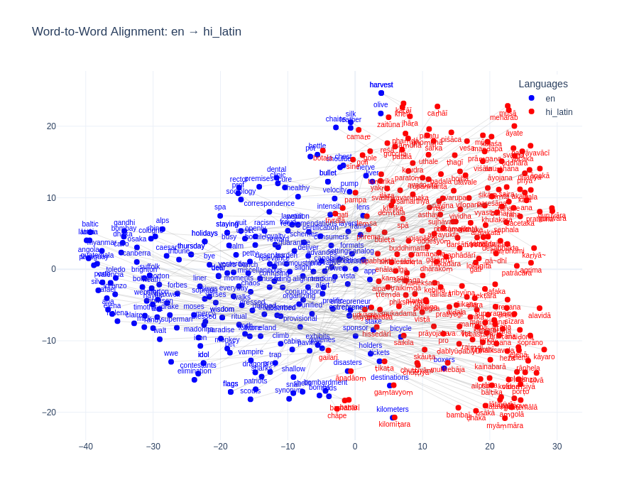

The visual comparison of alignment quality across different approaches reveals the progressive improvement in cross-lingual mapping:

1. **Initial Unaligned State** ([assets/images/comparison_en_vs_hi.png](assets/images/comparison_en_vs_hi.png)): The original embedding spaces show complete separation between English (blue) and Hindi (red) words, with distinct clusters that have minimal overlap.

2. **Supervised Alignment** ([assets/images/word_pair_alignment.png](assets/images/word_pair_alignment.png)): Using the supervised approach with a bilingual dictionary, the alignment shows significant improvement, with considerable overlap between the two language clusters, though some separation remains visible.

3. **Unsupervised Alignment** ([assets/images/aligned_pairs_en-hi_latin_20250407_234041.png](assets/images/aligned_pairs_en-hi_latin_20250407_234041.png)): The unsupervised approach with Hindi transliteration shows the most integrated alignment, with substantial mixing of the language clusters. The boundaries between languages are less distinct, indicating a more unified semantic space.

Several word pairs in the unsupervised alignment exhibit nearly perfect overlap in the embedding space, demonstrating successful semantic mapping across languages:

| English      | Hindi (IAST) | Semantic Domain |
|--------------|--------------|-----------------|
| "intensity"  | "tīvratā"    | Physical property |
| "destinations" | "gamtavyam" | Travel/Movement |
| "olive"      | "zaitūna"    | Food/Agriculture |
| "velocity"   | "gati"       | Physics/Movement |
| "entrepreneur" | "udyamī"   | Business |
| "stake"      | "hissedārī"  | Business/Finance |
| "doctrine"   | "siddhānta"  | Philosophy/Religion |
| "rainfall"   | "varṣā"      | Weather |
| "meditation" | "dhyāna"     | Spirituality |
| "heritage"   | "virāsat"    | Culture |

These well-aligned pairs span diverse semantic domains, highlighting the model's ability to capture cross-lingual semantic equivalence across different areas of meaning. The close alignment of these specific pairs demonstrates that even without an explicit bilingual dictionary, the unsupervised method can identify meaningful cross-lingual correspondences through distributional similarities in the embedding spaces.